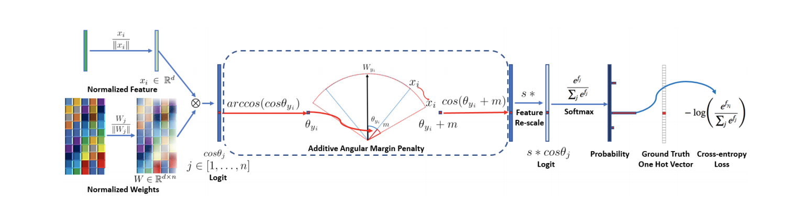
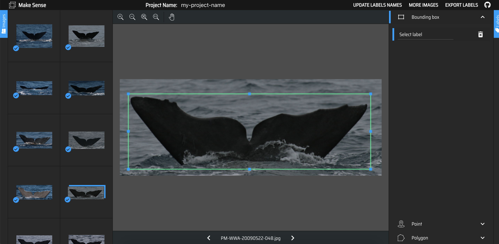
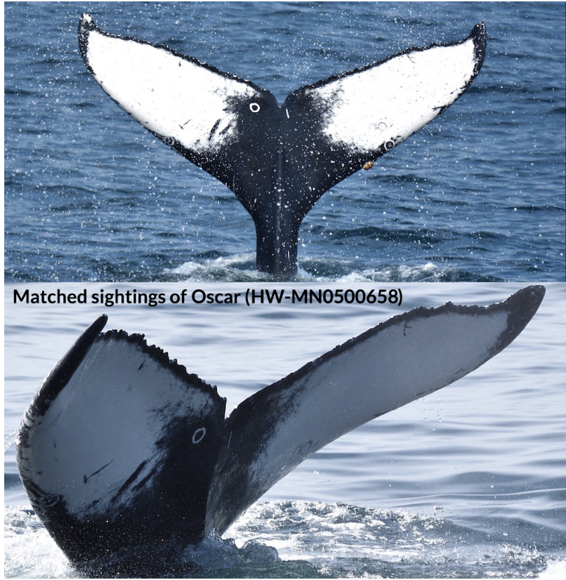
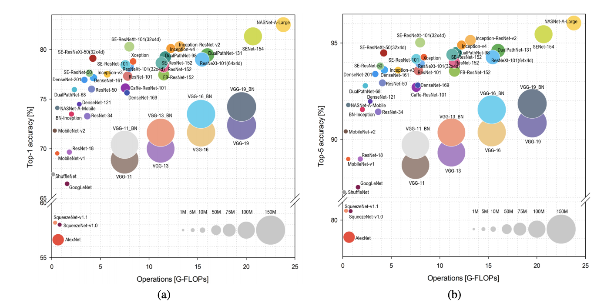
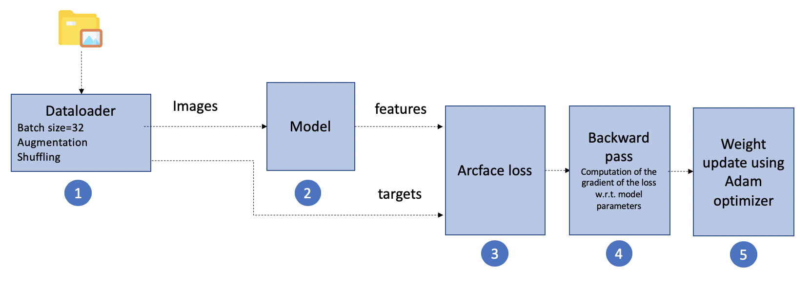
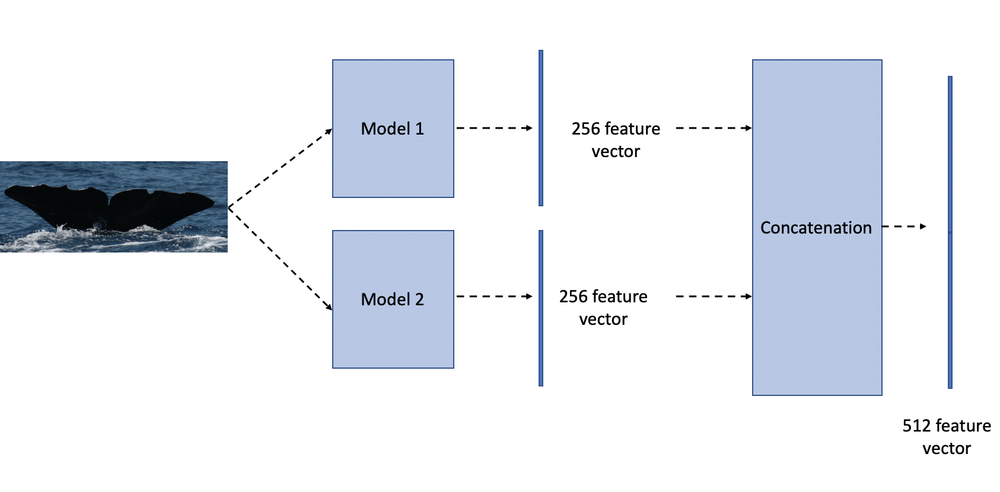

My solution of Global Data Science Game 2020

This repository contains the code I used to train the models and the following post details the approach undertaken.

More details about project [here](https://medium.com/@ahmedbesbes/a-hackers-guide-to-efficiently-train-deep-learning-models-b2cccbd1bc0a)

### Requirements

##### Libraries

- python 3.6+
- pytorch 1.1.0 (and higher)
- torchvision 0.3.0
- albumentations 0.4.4
- warmup_scheduler: `pip install git+https://github.com/ildoonet/pytorch-gradual-warmup-lr.git`
- PyTorch Image Models: `pip install timm`
- Pretrained models for Pytorch: `pip install pretrainedmodels`

### Some context first

Since we're asked to list the top 20 most similar images for each whale's fluke, I found that **metric learning techniques** worked better than a classification task where you would train a network to classify the images among all the ids and extract one hidden layer weights hoping for it to be a good representation vector for similarity measures.

Metric learning techniques are suitable to generate vector representations that are useful to compute a similarity measure (cosine, euclidean, etc.) between the items.

The most popular losses that allow to achieve this task are:

- Margin Loss
- Triplet Loss

In fact, if you look at the Humpback Whale Identification Kaggle competition, and more specifically at the solutions, you'll find out that most participant went for a Siamese Neural Network with a margin loss, and it worked quite well.

I tried triplet loss with hard sample mining (c.f. this article for more details) for about two months, and the best score I could achieve on the test leaderboard, for a single model, was about ~ **1370**. So two weeks before the deadline, I started searching for another method, and that's when I discovered the **arcface loss**, which literally blew my mind :). So I oubviously went for it.

### What is arcface loss

The arcface loss has been introduced in 2019 (CVPR) and its main goal is to maximize face class separability by learning highly discriminative features for face recognition. According to the writers of the paper, this method outperformed triplet loss, intra-loss and inter-loss on most common face identification benchmarks.

What does this loss exactly do?

When given a feature vector extracted from the network and the corresponding ground truth value (in this case, the whale id), arcface performs an operation to convert the computations in an angular space by computing the angle between the feature vector and the ground truth. Then, by adding a margin, like in the triplet loss or center loss scheme, it reverts back to the original space and applies a softmax.

The main benefit of this loss is the transition into a new space, where separability is maximized.

What are the benefits of this loss compared to softmax and triplet loss:

- It scales better for a large number of classes
- It alleviates the problem of hard sample mining encountered when training triplet losses (since it doesn't need one)
- It provides a nice geometric interpretation
- It provides a stable training

### My solution

Let's now dive into the solution:

##### 1- Data preprocessing

- I didn't use the -1 folder (although I tried including it in the training)
- I didn't use the whale ids with one image only (this gave a real improvement)
- I also extracted the bounding boxes (files uploaded in `data` folder) of the whales' fluke in order to discard any surrounding noises (water splashes, etc) and zoom on the relevant information. This acts as an **attention mechanism**.
- I tried removing some noisy images by hand but it didn't improve the results.

Note: I didn't use the pretrained Kaggle detection model but I trained a Fluke detector from scratch myself (yolo v3) after annotating about ~ 300 whales on this [tool](https://makesense.ai).

    

**Key learning :** Spend as much time as you can on the data: clean it, curate it, cross check it... Although powerful in representation learning, deep learning models are still garbage-in garbage out models. If you feed them noisy data, don't hope for good results.

##### 2- Never underestimate the power of transfer learning

The first weeks of the competition, I used ImageNet pretrained models as backbones. It was fine, my models ended up converging after some time. The top score I could achieve on the test leaderboard was about **1270**.

Then I looked into Humpback Whale Identification Kaggle competition data. I noticed a couple of things:

- The data has the same structure as our competition with the same class imbalance problem
- The flukes doesn't exactly look the same as in our competition.

    
    
 Kaggle whales' flukes

So I decided finetuning the ImageNet pretrained models on this data using the triplet loss.

Funny how things worked out:

- This had a huge impact! I jumped to 1300 on the test leaderboard
- The network was able to converge faster (30% less epochs)

**Key learning:** Transfer learning rarely hurts. If you start by ImageNet models that are pretrained on 1000 common objects (animals, cars, etc.), it's more likely that a pretrained network on a similar dataset of yours is better.

##### 3- Image resolution matters

As we've seen it, Lisa's images can be sometimes very large. This is due to professional cameras and tools she's using. Some images can even reach 3000x1200 or higher.

When I started the competition, I set the input size to 224x224 pixels, as I typically do in most image classification problems.

However, when I started varying the input sizes, I got a lift of performance with the 480x480 size.

**Tow key learnings here:**

- If you're dealing with high resolution images, try increasing the input size of your network. The default input shape of 224 recommended by ImageNet is not always the best choice. When having a larger input shape, your network can learn specific small fine-grained details that distinguish one whale from another.
- Bigger is not alwas better. If you increase your input shape to 1000px or so, you'll more likely encounter poor performance due to these reasons:
  - Slow convergence: with higher input shapes, your network has more parameters and this obviously needs more computational power and convergence is not guaranteed due to overfitting.
  - Poor performance on small images: when these are up-sampled to 1000px, the original signal is corrupt.

##### 4- Which backbone architecture to choose?

As we all know there's a large family of network architectures to choose from

    

After several experiments, I noticed that best performing architectures on our dataset are:

- resnet34
- densenet121

My best performing single model relies on densenet121.

**Key learnings :**

- Large and deep state-of-the-art architectures are not always the best choice:
  - if your dataset is small, they quickly overfit
  - if you have little computational resources, you won't be able to train them
- Experiment with increasing network capacity:
  - start simple: for example from MobileNet-v1 to ResNet-18, ResNet-34, Densenet121
  - keep increasing the complexity of the network while monitoring the validation performance
- Think about model size if you plan to put your model into production. That's why I opted for densenet121 which is less than 30Mb

##### 5- Training pipeline:

The training pipeline consists of 5 major steps:

    

- Step 1: the dataloder connects to the database and serves the images and the corresponding labels to the network, in batches. It's also responsible shuffling the data it between the epochs and applying on-the-fly data augmentation.
  **Heavy augmentation** has been applied as a regularization effect for a better generalization.
  Transformations include: Gaussian noise, blurring, motion blur, random rain (to simulate splash effects), color shift, random change in brightness, hue and saturation, sharpening, perspective and elastic transformations, random rotation ± 20°, affine transformations (translation and shearing), and random occlusion (to increase generalization capabilities)
  Here is the pipeline script:

- Step 2: forward pass.
  The model takes the images as input and generates the features.

- Step 3: the arcface loss is computed between the features and the targets

- Step 4: the loss.backaward() method is called where the gradients of the loss with respect to model parameters is computed

- Step 5: Here's when the Adam optimizer comes in. Based on the gradients computed in step 4, it updates the weights of the network. This operation is performed on each batch.

**Training tips**

I made **a lot** of experiments during this competition. Here is my list of tips when it comes to building a strong training pipeline:

- Adam is a safe optimizer. However, you should not forget to set the weight decay to a non-zero value. This acts as a regularization effect and prevents loss fluctuations. Used value: 1e-3
- Heavy augmentation **really improves** the results. I started with simple rotations and translations but when I added the transformations mentioned above I got better results. Augmentations alleviates the problem of the lack of data and improves the model stability and generalization.
- Use a learning rate scheduler to decrease the learning rate throughout the training. The one I chose is warmup scheduler follwed by a cosine annealing. It basically starts from very low learning rate to reach the target (starting learning rate) on a few epochs (this is called the warmup phase) and then decreases it following a cosine annealing until an end learning rate.
- Monitor the loss value at the end of each epoch. I used Tensorbaord to plot it.
- Pseudo labeling can give you an edge: this technique is commonly used in Kaggle competitions. It consists of
  - Training a model on you train data
  - Use the model on the test data to predict the classes
  - Take the most confident predictions of the test set (for example > .9 probability)
  - Add these new samples to the original train data
  - Retrain again

##### 6- What is my final solution

I trained two models following the previous pipeline with the following parameters:

|                           | model 1        | model 2        |
| ------------------------- | -------------- | -------------- |
| backbone                  | resnet34       | densenet121    |
| pretrained                | Kaggle data    | Kaggle data    |
| embedding size            | 256            | 256            |
| image size                | 620            | 480            |
| pseudo labels             | yes            | no             |
| learning rate             | 2.5e-4 to 5e-5 | 2.5e-4 to 5e-5 |
| batch size                | 32             | 16             |
| dropout                   | 0              | 0.5            |
| epochs                    | 70             | 90             |
| Score on test leaderboard | 1434           | 1450           |
| Classification layer      | no             | yes            |
| Embedding layer           | yes            | yes            |

What gave me a bump in the final score is the way I combined these two models. This is a simple **meta-embedding technique** that is quite commonly used in Natural Language Processing.

It consists of generating the embeddings of each model on all the samples, then concatenating them.

    

This method is used to generate the meta-embeddings of the train and test data sets. Then, the same computations are used to generate the submission.

**key learning**:

- meta learning concatenation techniques provide an interesting embedding when the base models are different in:
  - backbone architectures (resnet34 vs densenet121)
  - image input size (480 vs 620)
  - regularization schemes (dropout vs no dropout)
- The resulting embedding takes both of the two representation in a hybrid one.

### Final words

I would like to thank the whole GDSC team for their work in making this challenge a great learning opportunity and Lisa Steiner for giving us the chance to bring our knowledge to a new field.

I hope you'll find here resources that you can use in other computer vision and deep learning projects.

### References:

- Arcface paper: https://arxiv.org/pdf/1801.07698.pdf
- https://omoindrot.github.io/triplet-loss
- https://medium.com/1-minute-papers/arcface-additive-angular-margin-loss-for-deep-face-recognition-d02297605f8d
